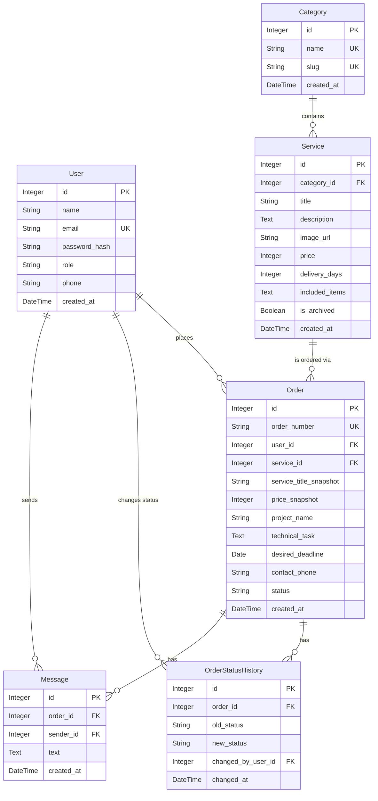

# Falcon Services - Raqamli Xizmatlar Platformasi

**"Falcon Services"** — bu mijozlar uchun raqamli xizmatlarni (Veb dasturlash, Grafik dizayn, SMM, Video montaj) qulay shaklda buyurtma qilish va ularning jarayonini kuzatish imkonini beruvchi zamonaviy platforma.

## 🛠 Texnologiyalar va Stack
Loyiha uchun zamonaviy va tezkor texnologiyalar yig'indisi tanlandi:
- **Backend (API):** `FastAPI` — Python'dagi eng tezkor va asinxron freymvorklardan biri bo'lib, Pydantic orqali ma'lumotlarni qat'iy tekshirish imkonini beradi. Swagger UI integratsiyasi avtomatik ishlaydi.
- **Ma'lumotlar Bazasi:** `SQLAlchemy` (ORM) va `SQLite` (ishlab chiqish uchun) — ma'lumotlar bazasi bilan xavfsiz va obyektga yo'naltirilgan tarzda ishlash uchun tanlandi. (PostgreSQL ga osongina o'zgartirish mumkin).
- **Autentifikatsiya:** `JWT (JSON Web Tokens)` va `Passlib (Bcrypt)` — xavfsiz sessiyasiz autentifikatsiya standarti, mobil va frontend ilovalar uchun eng qulay usul.
- **Frontend (UI):** `Jinja2` va `TailwindCSS` — server-side rendering orqali sahifalarni tez yuklash hamda Tailwind orqali zamonaviy va responsiv (moslashuvchan) dizayn yaratish uchun tanlandi. Statistika uchun `Chart.js` kiritildi. JavaScript asosan Fetch API orqali backend bilan bog'lanish uchun ishlatildi.

## 📊 Ma'lumotlar Bazasi Sxemasi (ER-Diagram)
Quyida loyihadagi 6 ta asosiy jadval va ularning bog'lanishlari ko'rsatilgan:



## ⚙️ O'rnatish va Ishga tushirish

Loyihani lokal muhitda ishga tushirish uchun quyidagi qadamlarni bajaring:

1. **Repozitoriyni yuklab olish:**
   ```bash
   git clone <repo-url>
   cd falcon_services
   ```
2. **Virtual muhit (venv) yaratish va faollashtirish:**
   ```bash
   python -m venv venv
   # Windows uchun:
   venv\Scripts\activate
   # Mac/Linux uchun:
   source venv/bin/activate
   ```
3. **Kutubxonalarni o'rnatish:**
   ```bash
   pip install -r requirements.txt
   ```
4. **Muhit o'zgaruvchilarini sozlash (`.env`):**
   Loyiha papkasida `.env` faylini yarating (namuna `.env.example` da mavjud):
   ```env
   SECRET_KEY=supersecretkey-change-it-in-production
   ALGORITHM=HS256
   ACCESS_TOKEN_EXPIRE_MINUTES=30
   ```
5. **Serverni ishga tushirish:**
   ```bash
   uvicorn main:app --reload
   ```
   *Loyiha ishga tushganda bazani avtomatik yaratadi va boshlang'ich ma'lumotlar bilan to'ldiradi (`seed.py`).*

## 👥 Boshlang'ich Ma'lumotlar va Demo Akkauntlar
Loyiha ishga tushganda `seed.py` fayli orqali quyidagi demo foydalanuvchilar, kategoriyalar va 12 ta xizmat avtomatik qo'shiladi:

| Rol | Email | Parol |
|---|---|---|
| Administrator | admin@falcon.uz | admin123 |
| 1-Mijoz | mijoz1@falcon.uz | mijoz123 |
| 2-Mijoz | mijoz2@falcon.uz | mijoz123 |

## 🧪 Avtomatlashtirilgan Testlar
Loyiha barqarorligini ta'minlash uchun `pytest` yordamida izolyatsiya qilingan (alohida test xotirasida ishlovchi) avtomatlashtirilgan testlar yozilgan.

**Testni ishga tushirish:**
```bash
pytest -v
```
**Test qilinadigan ssenariylar (kamida 7 ta):**
1. Ro'yxatdan o'tishda ruxsatsiz Administrator rolini saqlab qolishdan himoya va takroriy email blokirovkasi.
2. Buyurtma berish formasi validatsiyasi (Texnik topshiriq va kun tekshiruvi).
3. **Narx muzlatilishi (Price Snapshot)**: Xizmat narxi o'zgarganda, oldingi buyurtma narxi saqlanib qolishi.
4. **IDOR Himoyasi**: Mijozlar faqat o'z buyurtmalarini ko'ra olishi va yoza olishi.
5. Oddiy foydalanuvchini Admin paneldan uzib qo'yish (`403 Forbidden`).
6. Holatlar (State Machine) mantig'i: sakrab o'tishni cheklash va mijoz huquqlarini tekshirish.
7. Xizmatni arxivlash (Soft delete): katalogda yashirish, lekin buyurtmalarni saqlab qolish.

## 🤖 AI Vositalaridan Foydalanish
Loyiha davomida sifatni oshirish va tezlikni ta'minlash maqsadida **Antigravity AI (Gemini 3.1 Pro)** agentidan quyidagi vazifalar uchun foydalanildi:
1. Ma'lumotlar bazasi modellarini ORM da (SQLAlchemy) optimal loyihalash va munosabatlarni o'rnatish.
2. `seed.py` uchun realistik o'zbek tilidagi ma'lumotlarni, professional Unsplash rasm URL lari bilan shakllantirish.
3. Frontend qismi uchun `TailwindCSS` va `Jinja2` kombinatsiyasida zamonaviy dizayn tuzish (ayniqsa admin dashboard va chat interfeyslari).
4. Murakkab mantiq talab qiladigan API tekshiruvlari va `pytest` qamrovini tezkor yozish.

> **Eslatma / Cheklovlar:** Imtihon topshirig'iga binoan, loyihada real to'lov tizimi ulanmagan. Admin dashboard panelida ko'rsatilgan "Yakunlangan buyurtmalar summasi" faqat hisobot xarakteriga ega va jami qiymatni bildiradi.
