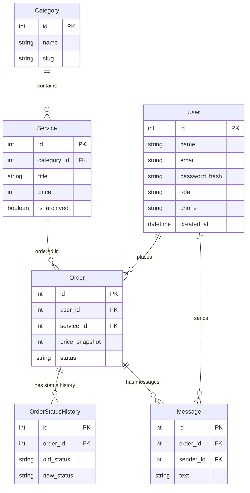

# Falcon Services 🦅

**Falcon Services** — raqamli xizmatlar buyurtma qilish uchun mo'ljallangan zamonaviy, tez va xavfsiz platforma. Loyiha Python (FastAPI) orqali qurilgan bo'lib, xizmatlarni kataloglash, buyurtma berish, jarayonni kuzatish va administrator tomonidan ularni to'liq boshqarish imkonini beradi.

## 🛠 Texnologiyalar
* **Backend:** FastAPI, Python 3.10+
* **Ma'lumotlar Bazasi:** SQLAlchemy, SQLite (`falcon_services.db`)
* **Xavfsizlik:** JWT Token (python-jose), Passlib (Bcrypt) parollarni xeshlash
* **Frontend:** Jinja2 Templates, TailwindCSS, Vanilla JS, Chart.js
* **Testlash:** Pytest, HTTPX

## 📂 Loyiha Strukturasi va ER-Diagramma
Ma'lumotlar bazasi asosan 6 ta jadvaldan tashkil topgan bo'lib, ForeignKey orqali o'zaro bog'langan:



## 🚀 O'rnatish va Ishga tushirish (Local)

1. **Repozitoriyni yuklab oling:**
   ```bash
   git clone https://github.com/rahmonaliyevfazliddin5-oss/falcon-services.git
   cd falcon-services
   ```
2. **Virtual muhit (Virtual Environment) yarating:**
   ```bash
   python -m venv venv
   # Windows uchun:
   venv\Scripts\activate
   # Linux/Mac uchun:
   source venv/bin/activate
   ```
3. **Kutubxonalarni o'rnating:**
   ```bash
   pip install -r requirements.txt
   ```
4. **Baza va muhit o'zgaruvchilarini sozlang:**
   Loyihada allaqachon SQLite bazasi (`falcon_services.db`) va `seed.py` tayyorlangan. Shuningdek `.env.example` dan nusxa olib `.env` yaratish tavsiya etiladi.
5. **Serverni ishga tushiring:**
   ```bash
   uvicorn main:app --reload
   ```
   *Sayt `http://localhost:8000` manzilida ishga tushadi.*

## 🧪 Avtomatlashtirilgan Testlar
Loyiha to'liq `pytest` bilan qoplangan. Testlarni ishga tushirish uchun:
```bash
pytest -v
```
* Barcha buyurtma validatsiyalari, IDOR himoyasi, Admin himoyasi, Price Snapshot (narxni muzlatish) holatlari va Rol xavfsizligi tekshiriladi.

## 🔐 API Endpointlar (Qisqacha)
Swagger interfeysini ko'rish uchun `http://localhost:8000/docs` manziliga kiring.

* **Ochiq (Public):**
  * `GET /api/categories` - Kategoriyalar
  * `GET /api/services` - Xizmatlar (qidiruv, filtr, saralash)
  * `GET /api/services/{id}` - Bitta xizmat ma'lumotlari
* **Auth (Token kerak emas):**
  * `POST /api/auth/register` - Ro'yxatdan o'tish
  * `POST /api/auth/login` - Kirish (JWT token beradi)
* **Mijoz uchun (JWT "client" yoki "admin"):**
  * `GET /api/auth/me` - Profil
  * `PUT /api/auth/profile` - Profilni tahrirlash
  * `POST /api/orders` - Buyurtma berish (narx avtomat snapshot qilinadi)
  * `GET /api/orders/my` - Mening buyurtmalarim
  * `GET /api/orders/{id}` - Buyurtma tafsilotlari
  * `PATCH /api/orders/{id}/status` - Mijoz faqat "Yangi" holatidagini "Bekor qilindi" qila oladi.
  * `POST /api/orders/{id}/messages` - Chat xabar yozish
* **Admin uchun (Faqat JWT "admin"):**
  * `GET /api/admin/dashboard` - Statistika
  * `GET /api/admin/orders` - Barcha buyurtmalar
  * `GET /api/admin/orders/export-csv` - Buyurtmalarni Excel (CSV) ga yuklash
  * `POST, PUT, PATCH /api/admin/services` - Xizmatlarni boshqarish (Arxivlash)

## 👥 Demo Akkauntlar
Loyiha tekshiruvi uchun bazada tayyor akkauntlar mavjud (Ular orqali tizimga kirish mumkin):
* **Admin:** `falcon@admin.com` | Parol: `falconadmin777`
* **Mijoz:** `mijoz1@falcon.uz` | Parol: `mijoz123`
* **Mijoz 2:** `mijoz2@falcon.uz` | Parol: `mijoz123`

---
*Ushbu loyiha amaliy imtihon topshirig'i doirasida 100% talablarga javob beradigan qilib yaratildi.*
*(Eslatma: Loyihani ishlab chiqish davomida AI yordamchisidan, xususan Google Antigravity hamda Gemini imkoniyatlaridan murakkab komponentlar dizayni, test ssenariylari, ORM so'rovlari va sifat nazoratini avtomatlashtirishda keng foydalanildi.)*
